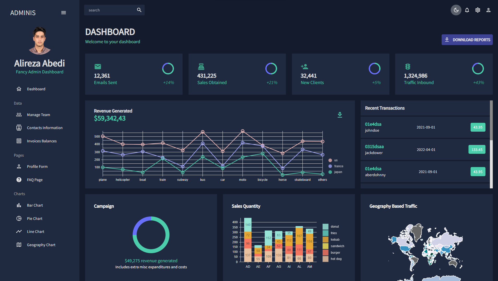

<h1 align='center' style="font-size:5rem"><b>Admin Panel Dashboard</b></h1>

   
<h2 align='center'>
    With this admin panel you can manage your website and data in your database with React.
</h2>

   

    <h2>Dark Mode</h2>
    </img>

    <h2>Light Mode</h2>
    </img>

    

<h1 align='center'><b>Abilities</b></h1>

<ul>
    <li> Able To Run Manage The database's data</li>
    <li> Able To Use Charts To Show Data</li>
</ul>

    
<h1 align='center'><b>Language and technologies used in This Project</h1>

    

<h1 align='center'><b>Requirements</b></h1>

Download and install `NodeJS` from official website <a href="https://nodejs.org/">nodeJS.org</a>

    

<h1 align='center'><b>How To Run</b></h1>

At first you have to clone the project and open it in `IDE`

 

Open IDE's terminal and then write `~ npm i` to install dependencies

 

Then write `~ npm run dev` and then enter

Congratulations ,now you use the dashboard to manage your website.
